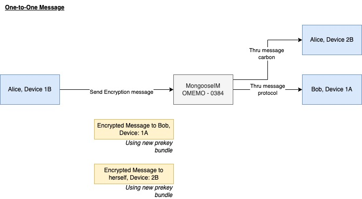

# Dart Library for Signal/Omemo-like encryption 

## Supported XEP and Version:

* Supported for [XEP-0384](https://xmpp.org/extensions/xep-0384.html) version 0.8.3
* No support for [XEP-0454](https://xmpp.org/extensions/xep-0454.html) yet


## End-to-end Encryptions

* OMEMO 1-1 End-to-end Encryption with Double Ratcheting
* OMEMO Group End-to-end Encryption with Double Ratcheting
* Whatsapp-like Group End-to-end Encryption with Sender Key (Not supporting Multi-device)

## Feature

- Using Curve25519 (x25519) key type
- Generate identifer key-pair
- Generate prekey list
- Generate signed key
- Generate last resort prekeys
- Sign/Verify signature
- Double Ratchet, Forward Secrecy
- Protobuf support for OMEMO protobuf schema specific (with minor modified field) - original proto: https://xmpp.org/extensions/xep-0384.html#protobuf-schema
- Protobuf support for local storage to serialize session and session state and all of it content to/from fromBytes
- Storage interface can be extended (TODO: improve relevant function with serialization)
- [Test] Partially tested for different classes and some integration tests (mixed with Unit test coverage for now)
- [Test] Dummy Conversation Person/Group for integrating test

## Inspiration and Notable Mentions

- Dart Signal Protocol: https://github.com/MixinNetwork/libsignal_protocol_dart
- JS Axolotl: https://github.com/joebandenburg/libaxolotl-javascript

## Getting started

### How personal chat end-to-end encryption



Code snippet of implmentation check Usage section.
Another example in test cases at : `test/integration/omemo_multi_device_dm_test.dart`. But in this test, it was wrapped to `ChatUser`, `ConversationPerson` and `ConversationGroup` for easier test integration with random of sender and receiver plus number of message exchanges.


### How group chat end-to-end encryption


#### Multi-device group chat end-to-end encryption using same implement as 1-1 Encryption


Good read on pointing out difference of this (Signal/Omemo) implementation and Whatsapp: https://www.reddit.com/r/signal/comments/a2ogk2/this_is_how_signal_protocol_encrypts_group/

Private Group Messaing from Signal: https://signal.org/blog/private-groups/

We need to handle it the same as 1-1, using different prekey for different group members and send N messages (per 1 session message) to N members using OMEMO xep protocol. I would have have to improve to manage session state to keep track of pre key and session for each user/group.


Implementation example in test cases at : `test/integration/omemo_multi_device_group_test.dart`. But in this test, it was wrapped to `ChatUser`, `ConversationPerson` and `ConversationGroup` for easier test integration with random of sender and receiver plus number of message exchanges of the group and different devices.


#### Single-device group chat end-to-end encryption using sender key

Implementation based on Whatsapp WhitePaper  https://scontent.whatsapp.net/v/t39.8562-34/271639644_1080641699441889_2201546141855802968_n.pdf/WhatsApp_Security_Whitepaper.pdf?ccb=1-5&_nc_sid=2fbf2a&_nc_ohc=PLXsX2a9-J0AX84iQt4&_nc_ht=scontent.whatsapp.net&oh=01_AVwKBcZxxD_xh8v6mJj6V7rM0By0Fzl6ceVBZZfiYCOj5Q&oe=62060AFE page 10)

The first time a WhatsApp group member sends a message to a group:

1. The sender generates a random 32-byte Chain Key.
2. The sender generates a random Curve25519 Signature Key
key pair.
3. The sender combines the 32-byte Chain Key and the public key from
the Signature Key into a Sender Key message.
4. The sender individually encrypts the Sender Key to each
member of the group, using the pairwise messaging protocol explained
previously.

For all subsequent messages to the group:

1. The sender derives a Message Key from the Chain Key, and updates
the Chain Key.
2. The sender encrypts the message using AES256 in CBC mode.
3. The sender signs the ciphertext using the Signature Key.
4. The sender transmits the single ciphertext message to the server, which
does server-side fan-out to all group participants.

The “hash ratchet” of the message sender’s Chain Key provides forward
secrecy. Whenever a group member leaves, all group participants clear their
Sender Key and start over.

In Chat Device Consistency information is included when distributing a
“Sender Key” and then excluded from the subsequent messages encrypted
with the Sender Key

Code snippet:

```dart

    const alice = SessionUser(name: '62344785747', deviceId: '2');
    const tom = SessionUser(name: '62344785749', deviceId: '33');
    const groupSender = SessionGroup(
        groupId: 'private-group', groupName: 'Private group', sender: alice);
    final aliceStore = GroupMemoryStorage();
    final bobStore = GroupMemoryStorage();
    final tomStore = GroupMemoryStorage();

    final aliceSessionBuilder = GroupSessionFactory(aliceStore);
    final bobSessionBuilder = GroupSessionFactory(bobStore);
    final tomSessionBuilder = GroupSessionFactory(tomStore);

    final aliceGroupCipher = GroupSessionCipher(aliceStore, groupSender);
    final bobGroupCipher = GroupSessionCipher(bobStore, groupSender);
    final tomSessionCipher = GroupSessionCipher(tomStore, groupSender);

    // Alice want to send message, so she need to send a SenderKeyDistributionMessage to all members of the group first
    final sentAliceDistributionMessage =
        await aliceSessionBuilder.create(groupSender);

    final receivedDistributionMessageFromAlice =
        WhisperSenderDistributionMessage.fromBytes(
            sentAliceDistributionMessage.serialized);
    await bobSessionBuilder.storeKeyDistribution(
        groupSender, receivedDistributionMessageFromAlice);
    await tomSessionBuilder.storeKeyDistribution(
        groupSender, receivedDistributionMessageFromAlice);

    Log.instance.v(tag, 'Alice sent: \'Hello bob and Tom\'');
    final ciphertextFromAlice = await aliceGroupCipher
        .encrypt(Uint8List.fromList(utf8.encode('Hello bob and Tom')));
    final plaintextFromAlice =
        await bobGroupCipher.decrypt(ciphertextFromAlice);
    final tomPlaintextFromAlice =
        await tomSessionCipher.decrypt(ciphertextFromAlice);

    // ignore: avoid_print
    Log.instance
        .v(tag, 'Bob get text from Alice: ' + utf8.decode(plaintextFromAlice));
    // ignore: avoid_print
    Log.instance.v(
        tag, 'Tom get text from Alice: ' + utf8.decode(tomPlaintextFromAlice));

    // Now Tom want want to send message, so she need to send a SenderKeyDistributionMessage to all members of the group first

    Log.instance.v(tag,
        '======== New message sender require to init new sender group ========');
    const groupSenderTom = SessionGroup(
        groupId: 'private-group', groupName: 'Private group', sender: tom);

    final tomSessionCipherNext = GroupSessionCipher(tomStore, groupSenderTom);
    final sentTomDistributionMessage =
        await tomSessionBuilder.create(groupSenderTom);
    Log.instance.v(tag, 'Tom sent: \'Hello alice and bob\'');
    final ciphertextFromTom = await tomSessionCipherNext
        .encrypt(Uint8List.fromList(utf8.encode('Hello alice and bob')));

    final receivedDistributionMessageFromTom =
        WhisperSenderDistributionMessage.fromBytes(
            sentTomDistributionMessage.serialized);
    await aliceSessionBuilder.storeKeyDistribution(
        groupSenderTom, receivedDistributionMessageFromTom);
    await bobSessionBuilder.storeKeyDistribution(
        groupSenderTom, receivedDistributionMessageFromTom);

    final aliceGroupCipherNext = GroupSessionCipher(aliceStore, groupSenderTom);
    final bobGroupCipherNext = GroupSessionCipher(bobStore, groupSenderTom);
    final alicePlaintextFromTom =
        await aliceGroupCipherNext.decrypt(ciphertextFromTom);
    final bobPlaintextFromTom =
        await bobGroupCipherNext.decrypt(ciphertextFromTom);
    Log.instance.v(
        tag, 'Alice get text from Tom: ' + utf8.decode(alicePlaintextFromTom));
    Log.instance
        .v(tag, 'Bob get text from Tom: ' + utf8.decode(bobPlaintextFromTom));

    Log.instance.v(tag, '======== Alice try to resend again ========');

    Log.instance.v(tag, 'Alice sent: \'How are you both?\'');
    final ciphertextFromAliceLast = await aliceGroupCipher
        .encrypt(Uint8List.fromList(utf8.encode('Hello bob and Tom')));

    final plaintextFromAliceLast =
        await bobGroupCipher.decrypt(ciphertextFromAliceLast);
    final tomPlaintextFromAliceLast =
        await tomSessionCipher.decrypt(ciphertextFromAliceLast);

```

## Usage

### Installation

TODO: add installation and import guides (*not yet published to pub spec*)

### Implement storage for your application

You should extend and implement the storage of the `storage/storage_interface.dart` which you could do:

- Init keys
- Store local identity, prekey, registration id, session
- Load back session, registration id, local identity key 

### Generate the first key for your first install of application of the user (or relogin)

```dart

import 'package:lib_omemo_encrypt/lib_omemo_encrypt.dart';

void main() {
    final axolotl = Axolotl();
    final alicekeyPackage = await axolotl.generatePreKeysPackage(preKeys);
    // ... next codes

```

As Alice, you can init your storage with the new keys and publish to server:

```dart


    // ..
    final aliceStore = MemoryStorage(
      localRegistrationId: alicekeyPackage.registrationId,
      localIdentityKeyPair: alicekeyPackage.identityKeyPair,
    );
    // Store your local pre keys
    aliceStore.setLocalPreKeyPair(alicekeyPackage.preKeys);
    // Publish your key to server based on your implementation
    // Let's say bob will fetch it


```

Bob fetch the keys from server and try to create session to catch

```dart

    // as bob, you init your own  keys

    final bobKeyPackage = await axolotl.generatePreKeysPackage(preKeys);
    final bobStore = MemoryStorage(
      localRegistrationId: bobKeyPackage.registrationId,
      localIdentityKeyPair: bobKeyPackage.identityKeyPair,
    );
    // Store your local pre keys
    bobStore.setLocalPreKeyPair(bobKeyPackage.preKeys);

    // You fetch alice key from server
    final bobReceivingPreKeyPublic = alicePreKey_fromServer;
    final bobReceivingSignKey = aliceSignedPreKey_fromServer;
    final bobReceivingIdentityKey = aliceSignedIdentityKey_fromServer;
    final signature = aliceSignature_fromServer;

    // Alice set key for Bob # use key 0
    const aliceUserId = 'alice@example.co'; // From server (e.g. in chat app you can fetch their id based on your implementation)
    final bobReceivingBundle = ReceivingPreKeyBundle(
        userId: aliceUserId,
        identityKey: bobReceivingIdentityKey,
        preKey: bobReceivingPreKeyPublic,
        signedPreKey: bobReceivingSignKey,
        signature: signature);


```

As bob, you are ready to create session:

```dart

    // Bob try to init the first cipher session
    final bobSessionFactory = SessionFactory(store: bobStore);
    var bobSession = await bobSessionFactory
        .createSessionFromPreKeyBundle(bobReceivingBundle);

    final bobCipherSession = SessionCipher();

    // Bob can encrypt message and set new session state
    final encryptedMsg = await bobCipherSession.encryptMessage(
        senderSession, Utils.convertStringToBytes('Hello Alice'));
    // Important to set back the latest session
    bobSession = encryptedMsg.session;


```

Now as Alice, you are receiving the prekey whisper message from bob:

```dart

    
    final aliceSessionFactory = SessionFactory(store: aliceStore);
    final aliceCipherSession = SessionCipher();

    Session _aliceSession = Session();
    // Encrypted message from Bob
    if (encryptedMsg.isPreKeyWhisperMessage) {

        // You can session from prekey whisper message
        final _ciperSession =
            await aliceSessionFactory.createSessionFromPreKeyWhisperMessage(
                _aliceSession, encryptedMsg.body);
        // Important to set back the latest session
        _aliceSession = _ciperSession.session;

        final decrypedMessage = await aliceCipherSession
            .decryptPreKeyWhisperMessage(_aliceSession, encryptedMsg.body);

        Log.instance.d(tag, 'Plain text: ${utf8.decode(decrypedMessage.plainText)}');
    } else {
    }

```

Now as Alice, you can want to send back the message to Bob:


```dart

    // Alice can encrypt message from session to 
    final encryptedMsg = await aliceCipherSession.encryptMessage(
        senderSession, Utils.convertStringToBytes('Hi Bob'));
    // Important to set back the latest session
    _aliceSession = encryptedMsg.session;

```

And now Bob, you receive the message from Alice.
You receive it as non-prekey whisper message.

```dart

    // Encrypted message from Alice
    if (encryptedMsg.isPreKeyWhisperMessage == false) {
        final decrypedMessage = await bobCipherSession
            .decryptWhisperMessage(bobSession, encryptedMsg.body);
        // Important to set back the latest session
        bobSession = decrypedMessage.session;

        Log.instance.d(tag, 'Plain text: ${utf8.decode(decrypedMessage.plainText)}');
    } else {
    }

// Closing above main
}

```

## Additional information

TODO: to add

## Development

- Update package: `dart pub get`

### Use protobuf

- add plugin `dart pub global activate protoc_plugin` / install it to mac: `brew install protobuf` (https://github.com/google/protobuf.dart/tree/master/protoc_plugin)
- Run

```bash

protoc --proto_path=./ --plugin=protoc-gen-dart=$HOME/.pub-cache/bin/protoc-gen-dart  --dart_out=./ lib/protobuf/OMEMOMessage.proto  lib/protobuf/OMEMOKeyExchange.proto  lib/protobuf/OMEMOAuthenticatedMessage.proto lib/protobuf/WhisperSenderMessage.proto lib/protobuf/WhisperSenderDistributionMessage.proto lib/protobuf/LocalStorage.proto

```

### Write test

### Running test


- Generate mock classes: `dart run build_runner build`
- Run test: `flutter test`
- Run coverage: `flutter test --coverage --test-randomize-ordering-seed random`
### Show coverage report with cov gobally

- (once) Add global cov: `flutter pub global activate test_cov_console`
- Run to see report:  flutter pub global run test_cov_console
